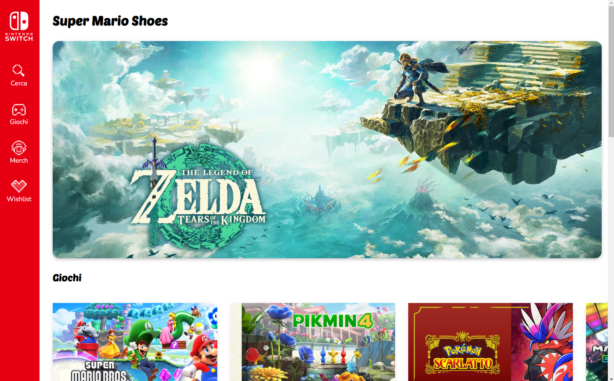

<!-- PROJECT -->

<a id="readme-top"></a>

<div align="center">
 

  <h3 align="center">Super Mario Shoes</h3>

  <p align="center">
    The first team project made during the Frontend - Coding Bootcamp at Edgemony.
  </p>
</div>

<!-- TABLE OF CONTENTS -->
<details>
  <summary>Table of Contents</summary>
  <ol>
    <li>
      <a href="#about-the-project">About The Project</a>
      <ul>
        <li>
            <a href="#built-with">Built With</a>
        </li>
        <li>
            <a href="#system-architecture">System Architecture</a>
        </li>
        <li>
            <a href="#modules">Modules</a>
        </li>
                <li>
            <a href="#data">Data</a>
        </li>
      </ul>
    </li>
    <li>
        <a href="#getting-started">Getting Started</a>
    </li>
    <li>
        <a href="#contacts">Contacts</a>
    </li>
    <li>
        <a href="#references">References</a>
    </li>
    <li>
        <a href="#license">License</a>
    </li>
  </ol>
</details>

<!-- ABOUT THE PROJECT -->

## About The Project

This project is a web application that showcases a collection of games and merchandise. The application allows users to view and interact with the items, and possibly add them to a wishlist.

### Built With

<div display="flex">
  
    
    
    
</div>

### System Architecture

The project is built using JavaScript, HTML, and CSS. The JavaScript files are organized into modules, each responsible for a specific functionality. The main entry point of the application is the script.js file, which imports and initializes the various modules.

#### Modules

- `genCards.js`: This module is responsible for generating cards for the games and merchandise. It exports a function `createCardsAndAppendToList` that takes an array of items and a list element as arguments.
- `handleWishlist.js`: This module handles the wishlist functionality. It exports a function `handleWishlistIcon` that is used to toggle the wishlist icon for each item.
- `addRandomItem.js`: This module adds a random item to the wishlist. It exports a function `randomToWishlist` that is used to generate a random item and add it to the wishlist.
- `filterCategories.js`: This module handles the filtering of items by category. It exports several functions and variables that are used to filter the items.

### Data

The project uses two data files: `games.js` and `merch.js`. These files contain arrays of objects that represent the games and merchandise, respectively. Each object has properties such as `id`, `img`, `name`, `description`, `price`, and `category`.

<p align="right">(<a href="#readme-top">back to top</a>)</p>

<!-- GETTING STARTED -->

## Getting Started

To get a local copy up and running follow these simple example steps.

1. Clone the repository to your local machine
   ```sh
   git clone https://github.com/majinbrum/super-mario-shoes
   ```
2. Change git remote url to avoid accidental pushes to base project
   ```sh
   git remote set-url origin github_username/repo_name
   git remote -v # confirm the changes
   ```
3. Open the `index.html` file in a web browser to view the application or use `Live Server`, open your web browser and navigate to http://localhost:3000.

<p align="right">(<a href="#readme-top">back to top</a>)</p>

<!-- CONTACTS -->

## Contacts

**Bruna Alamia** **-** [@linkedin](https://linkedin.com/in/brunaalamia) **-** brunaalamia@gmail.com

<p align="right">(<a href="#readme-top">back to top</a>)</p>

<!-- LICENSE -->

## License

This project is licensed under the MIT License.

<p>Copyright (c) 2024 Bruna Alamia

Permission is hereby granted, free of charge, to any person
obtaining a copy of this software and associated documentation
files (the "Software"), to deal in the Software without
restriction, including without limitation the rights to use,
copy, modify, merge, publish, distribute, sublicense, and/or sell
copies of the Software, and to permit persons to whom the
Software is furnished to do so, subject to the following
conditions:

The above copyright notice and this permission notice shall be
included in all copies or substantial portions of the Software.

THE SOFTWARE IS PROVIDED "AS IS", WITHOUT WARRANTY OF ANY KIND,
EXPRESS OR IMPLIED, INCLUDING BUT NOT LIMITED TO THE WARRANTIES
OF MERCHANTABILITY, FITNESS FOR A PARTICULAR PURPOSE AND
NONINFRINGEMENT. IN NO EVENT SHALL THE AUTHORS OR COPYRIGHT
HOLDERS BE LIABLE FOR ANY CLAIM, DAMAGES OR OTHER LIABILITY,
WHETHER IN AN ACTION OF CONTRACT, TORT OR OTHERWISE, ARISING
FROM, OUT OF OR IN CONNECTION WITH THE SOFTWARE OR THE USE OR
OTHER DEALINGS IN THE SOFTWARE.</p>
